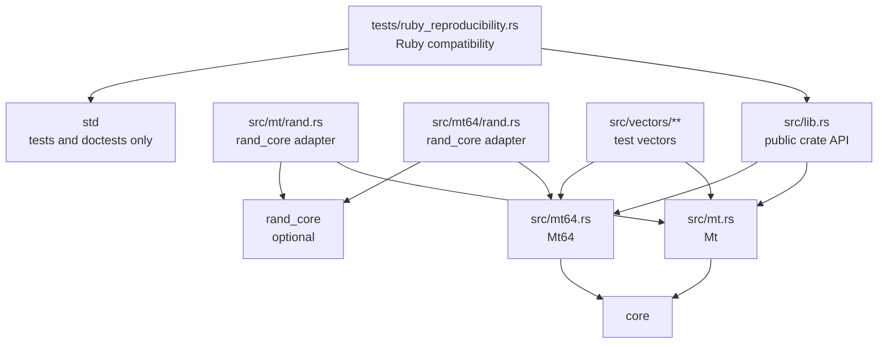

# Architecture

`rand_mt` is a small Rust crate that implements the reference `MT19937` and
`MT19937-64` Mersenne Twister pseudorandom number generators. The architecture
is intentionally flat: the public API is the crate root, each generator owns its
algorithm, optional integrations live next to the type they extend, and tests
carry the compatibility facts that must not drift.

The crate is optimized for deterministic behavior, Ruby compatibility, `no_std`,
and a stable public API. Mersenne Twister is not cryptographically secure, so
this crate should stay focused on reproducible pseudorandom streams, not entropy
collection or security-sensitive random generation.

## Bird's-Eye View

`rand_mt` exposes two stateful RNG types:

- `Mt`, the 32-bit `MT19937` generator.
- `Mt64`, the 64-bit `MT19937-64` generator.

Both types have the same high-level lifecycle:

The important boundary is between public constructors/output methods and the
private algorithm helpers. Callers can seed, reseed, sample, fill byte buffers,
and recover state, but they cannot observe or mutate the raw state directly.

## Code Map

The crate root, `src/lib.rs`, is the public front door. It sets crate-wide
lints, declares `#![no_std]`, re-exports `Mt` and `Mt64`, defines
`RecoverRngError`, and includes the README as doctest content. If a change
affects the public API, crate-level documentation, feature documentation, or
shared recovery errors, start there.

`src/mt.rs` contains the complete 32-bit generator. Look there for `Mt`, its
single-seed and key-seed constructors, `next_u32`, `next_u64`, `fill_bytes`,
state recovery, reseeding, tempering, untempering, and the twist step that
refills the state array.

`src/mt64.rs` mirrors `src/mt.rs` for the 64-bit generator. Look there for
`Mt64`, the `MT19937-64` constants, native `u64` output, truncating `u32`
output, byte filling, recovery, reseeding, tempering, untempering, and state
refill logic.

`src/mt/rand.rs` and `src/mt64/rand.rs` are the optional `rand_core`
integration. They are compiled only when the `rand-traits` feature is enabled
and implement `SeedableRng` and `TryRng` by delegating to the inherent methods
on `Mt` and `Mt64`. If a change touches `rand_core`, feature flags, or trait
behavior, keep the inherent API and trait API behavior aligned.

`src/vectors.rs`, `src/vectors/mt.rs`, and `src/vectors/mt64.rs` are test-only
golden data. They encode known seeded states and output sequences. Changes to
these files are compatibility-sensitive and should explain which upstream or
documented behavior changed.

`tests/ruby_reproducibility.rs` is the public integration check for MRI Ruby
compatibility. If a change affects `Mt` output, byte order, seeding,
`new_unseeded`, or Artichoke's Ruby-facing behavior, this test is part of the
contract.

The maintenance docs under `docs/` are not implementation layers. They are the
repository knowledge base for compatibility, release, dependency, testing, and
automation policy. `AGENTS.md` is the short routing layer that points agents to
the right guardrail for the current change.

## Dependency Shape

Production code depends on `core`. The optional `rand_core` dependency is
feature-gated behind `rand-traits`, which is enabled by default. `std` is only
brought in for tests and doctests.

## Architectural Invariants

- Output sequences are compatibility surfaces. Do not change seeded output, byte
  filling order, recovery behavior, or Ruby reproducibility unless the task
  explicitly calls for a compatibility change.
- `Mt` and `Mt64` are sibling implementations, not a shared generic engine. Keep
  them easy to compare, but avoid abstractions that obscure the reference
  constants or native word size behavior.
- `Mt` natively produces `u32`; its `next_u64` consumes two `u32` outputs.
  `Mt64` natively produces `u64`; its `next_u32` truncates one `u64` output.
- Seeds supplied as bytes are little endian. This is public API and trait API
  behavior.
- Recovery requires exactly one full state worth of tempered outputs: 624
  samples for `Mt` and 312 samples for `Mt64`.
- The crate remains `no_std` and no-alloc in production code. Do not introduce
  allocation, `std`, I/O, clocks, thread-local state, or OS entropy.
- The crate forbids unsafe code. Preserve `#![forbid(unsafe_code)]`.
- `rand_core` support is an adapter layer. It should delegate to inherent
  methods rather than creating an alternate implementation path.
- `new_unseeded` is deterministic shorthand for the reference seed. It must not
  gather entropy.

## Change Guide

For generator behavior changes, start in `src/mt.rs` or `src/mt64.rs`, then
update the relevant unit tests, golden vectors, and Ruby reproducibility tests.
Consult the testing and API stability guardrails before changing expected
output.

For feature or dependency changes, start in `Cargo.toml`, then check the
feature-gated adapter modules and docs. Verify default, all-features, and
no-default-features builds because feature flags are public API.

For documentation-only changes, keep this file as a map rather than an
implementation manual. Prefer stable module responsibilities, boundaries, and
invariants over line-by-line algorithm details that belong in code comments or
crate docs.
